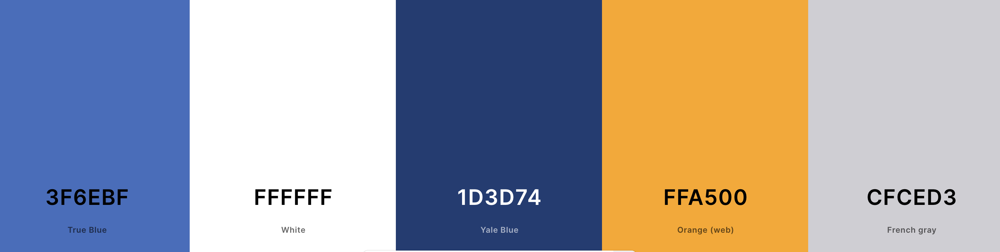

# Wissen - Your Gateway to Knowledge
Wissen is an innovative online learning platform designed to provide learners
with access to a diverse range of courses across various subjects, 
while empowering instructors to share their expertise and engage with 
students globally. With intuitive navigation, personalized recommendations,
and interactive features, Wissen offers a dynamic learning experience 
tailored to individual needs and preferences.

[Live Website here]()

## Features
Comprehensive Course Library: Explore a vast collection of courses covering topics such as programming, design, business, humanities, and more.
Expert Instructors: Learn from industry experts, academics, and professionals who bring real-world experience and insights to their courses.
Interactive Learning Experience: Engage with course materials through videos, quizzes, assignments, and interactive discussions.
Flexible Learning Options: Study at your own pace, anytime, anywhere.
Personalized Recommendations: Receive course recommendations based on your interests and learning preferences.
Certification and Recognition: Earn certificates of completion for successfully finishing courses.

## The Strategy Plane

### Site Goals 
* Free Access to course library without any cost barriers. Learning should be accessible to all, and at Wissen, it truly is.

* Instructor Diversity: instructors come from varied backgrounds, offering unique perspectives and insights. Whether they are from industry professionals, academics, or passionate hobbyists, users will receive a rich and diverse educational experience.

* Flexible Learning: Study will be anytime, anywhere. With Wissen, learning fits seamlessly into any lifestyle, allowing users to pursue knowledge on their terms.

* Empowering Passion: Wissen empowers individuals to share their passions and expertise with a global audience. Whether you're an expert in your field or simply passionate about a topic, Wissen provides the platform for you to make a difference.

### Agile Planning
This project was developed using agile methodologies by delivering small features in incremental sprints.
#### MoSCoW Prioritization

I chose to follow the MoSCoW Prioritization method for Wissen, identifying and labeling:

- **Must Haves**: the 'required', critical components of the project. Completing my 'Must Haves' helped me to reach the MVP (Minimum Viable Product) for this project early, allowing me to develop the project further than originally planned.
  
- **Should Haves**: the components that are valuable to the project but not absolutely 'vital' at the MVP stage. The 'Must Haves' must receive priority over the 'Should Haves'.
- **Could Haves**: these are the features that are a 'bonus' to the project, it would be nice to have them in this phase, but only if the most important issues have been completed first and time allows.
- **Won't Haves**: the features or components that either no longer fit the project's brief or are of very low priority for this release. 

#### Sprints

The project was divied into six sprints. This rapid sprint approach allowed me to break down the project into manageable chunks and maintain focus on delivering key features and functionality.

During each sprint, I divided my tasks into two main categories: Developer (Dev) Tasks and User Stories. These tasks were converted into issues and meticulously labeled on my project board. Every issue was tagged as either a user story , backend , frontend or a bug, providing clear reference points for development tasks.

Each user story was carefully crafted to include detailed information about its epic, acceptance criteria, and associated tasks. This structured approach helped me stay organized and prioritize my work effectively.

Furthermore, breaking down user stories into individual tasks enabled me to track progress and easily identify the next steps in the development process. This agile methodology proved invaluable in maximizing productivity and ensuring the timely completion of project milestones.

| Sprint No. | Sprint Content                  | Start/Finish Dates |
|------------|---------------------------------|--------------------|
| #1         | Backend setup                   | 01.05  ->  04.05   |
| #2         | Finish the backend              | 04.05  ->  08.05   |
| #3         | Backend Bugs solving            | 08.05  ->  11.05   |
| #4         | Front-end setup                 | 11.05  ->  15.05   |
| #5         | Implementing features           | 15.05  ->  18.05   |
| #6         | General testing and final steps | 18.05  ->  22.05   |

#### User Stories

User stories and features recorded and managed on [GitHub Projects](https://github.com/users/raneem-yad/projects/5)

#### Epics

**Homepage Features**

This Epic covers all the initial setup of the React application and HomePage.

**Authentication**

This epic covers Signing in and Signing up and logout.

**Course Discovery and Filtering**
This epic covers showing courses, search, filter the results. It also includes tags and Categories.

**Course Enrollment and Interaction**

This epic covers the front end for course details , comments , rating and enrolling.

**Instructor Functionality**
This epic covers The instructor functionality of creating a course  , video content .

**Profile Pages**
this epic covers each role profile for instructor and learner.

## UI (Surface) Plane

### Wireframes

Wireframes were created using [Balsamiq](https://balsamiq.com/) to plan content flow and styling for Wissen. Some differences can be seen between the original wireframes and the finished product, and this is due to design choices made during the creative process.

### Home Page 

### Recipe Details

### Search Recipes

### Add Recipes

## Site Structure 

The website is organized into several main sections to provide users with a seamless browsing experience. Upon landing on the homepage, users are greeted with a slider describing some info about the Website,also some cards showcasing the newest popular courses. They can also explore various courses according to categories,
another page includes filters, search to find course that suit their preferences. A search bar is available for users to quickly find specific course.

Registered users have access to their own user profile, where they can upload a profile picture, write a bio, and view the recipes they have added to the website. 
Each course has its own detailed page, displaying the title, learning goals, course requirements, reviews, ratings, and options to enroll the course with others.

For new users or those who need to log in, the website provides authentication pages for logging in and signing up. In case users encounter a page that does not exist or encounter a broken link, a custom 404 error page is available to guide them back to the main site.

Finally, the footer of the website contains essential info about the website, and links to the website's social media profiles, allowing users to stay connected and informed about the latest updates and news related to Wissen.

## Design Inspiration

The design ethos of Wissen draws inspiration from renowned e-learning platforms like Coursera and Udemy, renowned for their user-friendly interfaces and comprehensive course offerings. The name "Wissen" originates from the German word for "Knowledge," reflecting our core mission to empower learners worldwide with accessible education. Our logo, ingeniously crafted, combines the initial letter of "Wissen" with an open book icon, symbolizing the gateway to unlimited knowledge that our platform offers.

 

### Colour Scheme

**Primary Blue (#3F6EBF):** Symbolizing trust, intelligence, and tranquility, this shade of blue serves as the cornerstone of our color scheme.
It reflects the commitment to providing a reliable and secure learning environment while fostering a sense of calmness and focus for learners.

**Background White (#FFFFFF):** Clean and pristine, the pure white background creates a canvas for learning that is both spacious and inviting. 
It enhances readability and ensures that the content takes center stage, allowing learners to immerse themselves fully in their educational journey.

**Titles Navy Blue (#1D3D74):** Deep and authoritative, the navy blue titles add a touch of sophistication and professionalism to the interface. 
They command attention while maintaining harmony with the overall color palette, guiding users seamlessly through the platform.

**Warm Orange (#FFA500):** To infuse vibrancy and visual interest into design, by introducing an accent color that complements the primary blue hue. 
which adds depth and dimension to the user experience, creating moments of delight and intrigue throughout the platform.

  

### Font

Using [Google Fonts](https://fonts.google.com/), two fonts was opted: 

**DM Sans (Titles):** With its modern, sleek lines and subtle geometric shapes, DM Sans adds a touch of contemporary sophistication to website's titles and headings.
Its clean and minimalist aesthetic exudes professionalism and clarity, guiding users seamlessly through the interface while making a bold statement.

**Roboto (Normal Texts):** Designed for optimal legibility and versatility, Roboto serves as the backbone of our content, ensuring a smooth and comfortable reading experience for learners of all backgrounds. Its balanced proportions, friendly curves, and crisp letterforms strike the perfect balance between professionalism and approachability, making it an ideal choice for conveying information effectively and engaging users with our course materials.

  
  

