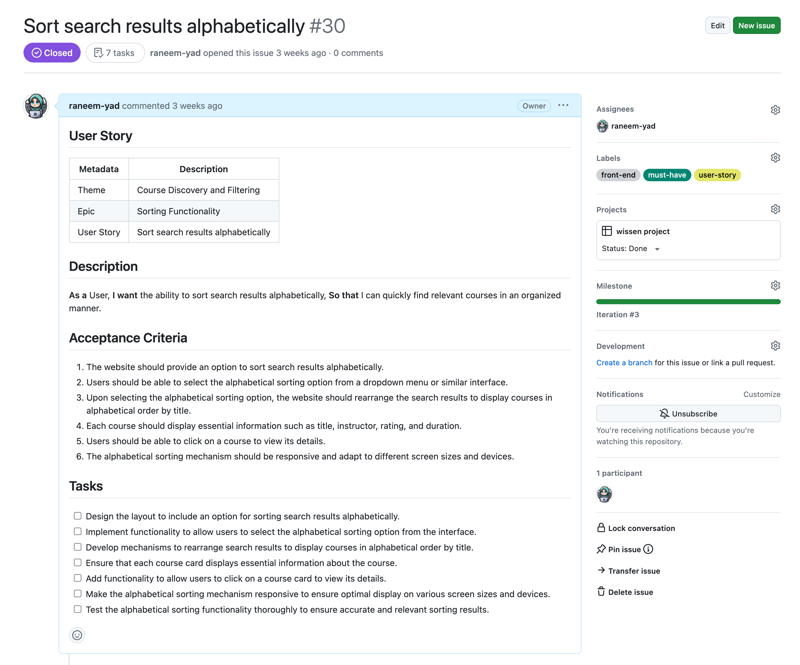

# Wissen - Your Gateway to Knowledge
Wissen is an innovative online learning platform designed to provide learners
with access to a diverse range of courses across various subjects, 
while empowering instructors to share their expertise and engage with 
students globally. With intuitive navigation, personalized recommendations,
and interactive features, Wissen offers a dynamic learning experience 
tailored to individual needs and preferences.

[Live Website](https://wissen-c163302e84c1.herokuapp.com/)

[BackEnd Website](https://wissen-api-61cc6e37e2b8.herokuapp.com/)

## The Strategy Plane

### Site Goals 
* Free Access to course library without any cost barriers. Learning should be accessible to all, and at Wissen, it truly is.

* Instructor Diversity: instructors come from varied backgrounds, offering unique perspectives and insights. Whether they are from industry professionals, academics, or passionate hobbyists, users will receive a rich and diverse educational experience.

* Flexible Learning: Study will be anytime, anywhere. With Wissen, learning fits seamlessly into any lifestyle, allowing users to pursue knowledge on their terms.

* Empowering Passion: Wissen empowers individuals to share their passions and expertise with a global audience. Whether you're an expert in your field or simply passionate about a topic, Wissen provides the platform for you to make a difference.

### Agile Planning
This project was developed using agile methodologies by delivering small features in incremental sprints.
#### MoSCoW Prioritization

I chose to follow the MoSCoW Prioritization method for Wissen, identifying and labeling:

- **Must Haves**: the 'required', critical components of the project. Completing my 'Must Haves' helped me to reach the MVP (Minimum Viable Product) for this project early, allowing me to develop the project further than originally planned.
  
- **Should Haves**: the components that are valuable to the project but not absolutely 'vital' at the MVP stage. The 'Must Haves' must receive priority over the 'Should Haves'.
- **Could Haves**: these are the features that are a 'bonus' to the project, it would be nice to have them in this phase, but only if the most important issues have been completed first and time allows.
- **Won't Haves**: the features or components that either no longer fit the project's brief or are of very low priority for this release. 


<hr>

#### Sprints

The project was divied into six sprints. This rapid sprint approach allowed me to break down the project into manageable chunks and maintain focus on delivering key features and functionality.

During each sprint, I divided my tasks into two main categories: Developer (Dev) Tasks and User Stories. These tasks were converted into issues and meticulously labeled on my project board. Every issue was tagged as either a user story , backend , frontend or a bug, providing clear reference points for development tasks.

Each user story was carefully crafted to include detailed information about its epic, acceptance criteria, and associated tasks. This structured approach helped me stay organized and prioritize my work effectively.

Furthermore, breaking down user stories into individual tasks enabled me to track progress and easily identify the next steps in the development process. This agile methodology proved invaluable in maximizing productivity and ensuring the timely completion of project milestones.

| Sprint No. | Sprint Content                  | Start/Finish Dates |
|------------|---------------------------------|--------------------|
| #1         | Backend setup                   | 01.05  ->  04.05   |
| #2         | Finish the backend              | 04.05  ->  08.05   |
| #3         | Backend Bugs solving            | 08.05  ->  11.05   |
| #4         | Front-end setup                 | 11.05  ->  15.05   |
| #5         | Implementing features           | 15.05  ->  18.05   |
| #6         | General testing and final steps | 18.05  ->  22.05   |


<hr>

#### User Stories

User stories and features recorded and managed on [GitHub Projects](https://github.com/users/raneem-yad/projects/5)


<hr>

#### Epics

**Homepage Features**

This Epic covers all the initial setup of the React application and HomePage.

**Authentication**

This epic covers Signing in and Signing up and logout.

**Course Discovery and Filtering**
This epic covers showing courses, search, filter the results. It also includes tags and Categories.

**Course Enrollment and Interaction**

This epic covers the front end for course details , comments , rating and enrolling.

**Instructor Functionality**
This epic covers The instructor functionality of creating a course  , video content .

**Profile Pages**
this epic covers each role profile for instructor and learner.


## UI (Surface) Plane

### Wireframes

Wireframes were created using [Balsamiq](https://balsamiq.com/) to plan content flow and styling for Wissen. Some differences can be seen between the original wireframes and the finished product, and this is due to design choices made during the creative process.

### Home Page 


### Course Details


### Search courses


### Add Courses


### Instructor Profile


### Student Profile


### login


### Singup


### Attending Course


## Site Structure 

The website is organized into several main sections to provide users with a seamless browsing experience. Upon landing on the homepage, users are greeted with a slider describing some info about the Website,also some cards showcasing the newest popular courses. They can also explore various courses according to categories,
another page includes filters, search to find course that suit their preferences. A search bar is available for users to quickly find specific course.

Registered users have access to their own user profile, where they can upload a profile picture, write a bio, and view the recipes they have added to the website. 
Each course has its own detailed page, displaying the title, learning goals, course requirements, reviews, ratings, and options to enroll the course with others.

For new users or those who need to log in, the website provides authentication pages for logging in and signing up. In case users encounter a page that does not exist or encounter a broken link, a custom 404 error page is available to guide them back to the main site.

Finally, the footer of the website contains essential info about the website, and links to the website's social media profiles, allowing users to stay connected and informed about the latest updates and news related to Wissen.


## Design Inspiration

The design ethos of Wissen draws inspiration from renowned e-learning platforms like Coursera and Udemy, renowned for their user-friendly interfaces and comprehensive course offerings. The name "Wissen" originates from the German word for "Knowledge," reflecting our core mission to empower learners worldwide with accessible education. Our logo, ingeniously crafted, combines the initial letter of "Wissen" with an open book icon, symbolizing the gateway to unlimited knowledge that our platform offers.

<br>


### Colour Scheme

**Primary Blue (#3F6EBF):** Symbolizing trust, intelligence, and tranquility, this shade of blue serves as the cornerstone of our color scheme.
It reflects the commitment to providing a reliable and secure learning environment while fostering a sense of calmness and focus for learners.

**Background White (#FFFFFF):** Clean and pristine, the pure white background creates a canvas for learning that is both spacious and inviting. 
It enhances readability and ensures that the content takes center stage, allowing learners to immerse themselves fully in their educational journey.

**Titles Navy Blue (#1D3D74):** Deep and authoritative, the navy blue titles add a touch of sophistication and professionalism to the interface. 
They command attention while maintaining harmony with the overall color palette, guiding users seamlessly through the platform.

**Warm Orange (#FFA500):** To infuse vibrancy and visual interest into design, by introducing an accent color that complements the primary blue hue. 
which adds depth and dimension to the user experience, creating moments of delight and intrigue throughout the platform.

  

### Font

Using [Google Fonts](https://fonts.google.com/), two fonts was opted: 

**DM Sans (Titles):** With its modern, sleek lines and subtle geometric shapes, DM Sans adds a touch of contemporary sophistication to website's titles and headings.
Its clean and minimalist aesthetic exudes professionalism and clarity, guiding users seamlessly through the interface while making a bold statement.

**Roboto (Normal Texts):** Designed for optimal legibility and versatility, Roboto serves as the backbone of our content, ensuring a smooth and comfortable reading experience for learners of all backgrounds. Its balanced proportions, friendly curves, and crisp letterforms strike the perfect balance between professionalism and approachability, making it an ideal choice for conveying information effectively and engaging users with our course materials.


## The Structure Plane

### Existing Features


#### Favicon
A site favicon with Website name was implemented with the sites' logo. 
This will allow users to easily identify Wissen Website when 
they have multiple tabs open.


#### Navigation 
The Website use navigation bar to easy access the website econtent!
Checks were implemented to detect when a user is signed in or signed out and nav items displayed accordingly.
This will prevent users from being able to click buttons from the UI in order to reach restricted pages.
And showing Nav items according to user role. It's also responsive so it collapses into a hamburger menu 
on smaller devices. This will ensure that no navigation items overlap and users can access and navigate the site
from any size device.

unregistered user

registered learner

registered instructor

responsiveness


#### HomePage - Hero Section 
Hero
The homepage hero section is the large eye-catching section that is just beneath the navigation bar. The hero is only displayed on the homepage as a Slider. 
It is used to catch the users attention, and to clearly showcase the general topic of the site. 
It features three large images with information about the website.


#### HomePage - Top Rated Courses
The Top three rated courses is a dynamic list of the top-rated courses that have been created by instructors.
Each course is displayed as a card, and each card has an image, course name, instructor profile image and  name, posted date , tags , description and in the card footer a rating of 5 stars and a button to the full recipe page.
This section is fully responsive, and cards stack on top of each other on smaller screens.


####  HomePage - Courses per Category
A maximum of six courses will be presented per category.
Currently, the website has three categories: Language Learning, Business and Management, and IT and Software Development.
When you click on any of the three categories, the latest six courses in that category will be displayed.


####  HomePage - Top Rated Instructors
The Top Rated Instructors is a dynamic list showcasing the top instructors. Each instructor's information is displayed on a card, which includes their image, name, job title, expertise, and a rating out of 5 stars. Additionally, each card provides statistics on the number of courses the instructor has created and the number of learners enrolled in those courses.


#### authentication - Sign Up
A user can navigate to the sign-up page via the site navigation bar if they are not logged in. The sign-up page contains all the required fields needed to create a user account. Since the website is designed for learning purposes, anyone can become an instructor. In the next version, only individuals with a certificate will be allowed to become instructors. Once a user correctly submits the form, they are redirected back to the login page to enter their newly created credentials.


#### authentication - Sign in
A user can navigate to the log in page via the site navigation bars if they are not already logged in.
The styling of the log in page is very similar to the rest of the user authorization pages.
The color scheme and background image are consistent, but the form fields are different. 
Once the log in form is submitted correctly the user is redirected to the homepage as a logged-in user.


#### Search Courses
The search functionality on the website allows users to easily find courses by entering keywords related to course names. Users can simply type their desired keywords into the search bar to view relevant courses matching their search criteria.

In addition to keyword search, the website also provides the option to sort courses alphabetically or by the date posted. By combining keyword search with sorting mechanisms, Wissen offers users a comprehensive and customizable search experience, enabling them to find exactly what they're looking for quickly and efficiently.

If no results are found for your search, a "Page Not Found" message will be displayed.


#### Course Details
The Course Details page displays the full information about a course. Each course has a dedicated Course Details page, which is available for all users to view, including non-logged-in users. The main purpose of this page is to present the full course description and requirements. Users typically navigate to a Course Details page by clicking the button on the course card either on the home page or the courses page. As the user has shown specific interest in the course, all relevant information about the course is displayed here.


The Course Details page also includes more details about the learning goals and video content.

At this **version**, uploading videos as course content has been implemented in the backend only. While the videos are available in the backend, they are not yet accessible on the front end. Currently, clicking on any video links will not work, as they are placeholders and a video player has not been created due to time constraints. This feature will be included in the next version or as a future enhancement.

#### Course Enrollment
When a learner chooses to enroll in a course, the Enrollment button is displayed. When the learner clicks on it, they will be enrolled in the course, and a green alert message will confirm the action. In this version, the enrollment process ends here due to time constraints. In the next version, the process will redirect the user to the course video content.


#### Share Course
The share feature on the website allows users to easily share their favorite courses with friends, family, and followers on social media platforms such as Facebook and Twitter.

When users come across a course they want to share, they can simply click on the share icon associated with that course. This action opens a popup or modal window with options to share the course on various social media platforms.

By leveraging the share feature, users can help spread the word about our courses and enable others to discover valuable learning opportunities.


#### Course Rating
The rating feature allows users to rate courses based on their experience, using a scale of one to five stars to represent the overall quality of the course. Users can provide their rating by clicking on the appropriate number of stars, ranging from one star for the lowest rating to five stars for the highest rating.

In addition to individual ratings, the website also displays the average rating for each course, calculated based on the collective ratings provided by all users. Beside the average rating, the number of people who have rated the course is shown, providing users with an indication of the course's popularity and the reliability of the average rating. This information helps users make informed decisions about which courses to try and enables them to gauge the consensus among other users.

All signed-in users can rate courses, except for the instructor who created the course. A small pop-up message will notify the instructor that they cannot rate their own course.


#### Courses Comments
Each course has a comment icon displaying the count of comments on the course.

At the bottom of each Course Details page, there is a comments section for users to post comments. Logged-in users can use the comment form to post a comment on that particular course. Comments are listed from the most recent at the top to the oldest at the bottom. The username of the comment author is displayed, along with the date, profile photo, and the body of the comment.

Comment creators can edit or delete their own comments. Upon deletion, a confirmation pop-up message will ask the user to confirm if they really want to delete the comment.


#### Create Course
Create Course allows instructors to submit courses to the Wissen site. The page is not accessible to unauthenticated users or learners; instructors must have a profile set up first. The page features consistent styling with the rest of the site for a cohesive look, and includes the header and footer navigation menus for easy user navigation.


#### Edit Course
An instructor can edit their courses by clicking on the edit button, which redirects them to an edit form. This form will be pre-filled with all the previous information of the course. Additionally, two requests will be sent to the backend to retrieve all available categories and tags.

After making the necessary edits, the instructor can click on the Update button. Upon clicking, the instructor will be redirected back to the Course Details page to see the updates they have made to their course.


#### Delete Course
An instructor can delete their courses easily from the Course Details page. If an instructor clicks the delete button, a delete confirmation message is displayed, seeking confirmation for the course deletion. The user then has the option to cancel the deletion by clicking the cancel button or to confirm the course deletion by clicking the delete button. The delete button is purposefully colored red as a warning.

If the user clicks the cancel button, the course content returns to normal. If the user clicks the delete button, the course is deleted from the database.

### instructor profile 
Upon clicking on the instructor's image or name, users will navigate to their profile page. The profile page includes comprehensive details about the instructor, such as their image, statistics (number of learners and courses created), and a section where learners can rate their instructors. Additionally, users can follow the instructor on LinkedIn or visit their website to explore other services they offer.

Underneath the instructor's information, a list of all courses created by the instructor will be displayed. If the instructor is viewing their own profile, an edit icon will appear to allow them to edit any information in their profile.


edit page 


### Learner profile 
Users can navigate to their profile by clicking on "Profile" in the navbar. The profile page includes information about the learner, and in the "My Learning" section, it shows all courses the learner has enrolled in. In future versions, a progress bar will be added to indicate the learner's progress in each course.

Similarly to the instructor's profile, if the learner is viewing their own profile, an edit icon will be shown. Clicking on this icon will navigate them to an edit form where they can update their profile information.


#### Website Confirmation Message 
Upon deleting actions, such as deleting a course or a comment, a pop-up confirmation message will ask the user if they are really sure they want to proceed with the action.


#### Website Alert Message
When a user performs actions such as creating or updating, an alert message will appear. The alert will have a green background color to indicate that the action was successfully completed, along with a corresponding success message. If an error occurs, a red background color will be used to indicate the issue, accompanied by an error message.


#### 404 Page
The 404 page is triggered when a user navigates to a site URL which doesn't exist.
This could be because of a number of reasons, 
including a faulty link or an expired URL.


<hr>

### Future Features 

1. Creating a UI page which enables instructors to upload their video content. 
2. Creating a UI to enable enrolled learners to watch the course content. 
3. Adding an FAQ section to each course. 
4. Dividing the process of adding a course into steps rather than using a long form on one page. 
5. Implementing login with social media accounts. 
6. Adding "Forgot Password" functionality. 
7. Integrating a payment system. 
8. Adding more types of content for courses, not just video. 
9. Implementing a rating system with comments to express why you chose to give this rating. 
10. When clicking on a category, showing all courses in that category.


### Component Reusability

Our application's architecture emphasizes reusability and modularity. Here is an overview of the reusable components:

#### `Avatar.js`

- **Description**: Displays user avatars with optional text.
- **Props**:
  - `src`: The image source URL for the avatar.
  - `height`: The size of the avatar (default `45`).
  - `text`: Optional text to display alongside the avatar.
- **Usage**: Used in user profiles, comment sections, and as navigational items.

#### `AlertMessage.js`

- **Description**: An alert message component for displaying messages with different styles and options to close.
- **Props**:
  - `variant`: String, variant of the alert (e.g., 'primary', 'secondary', 'success', 'danger', 'warning', 'info', 'light', 'dark').
  - `message`:  String, the message content to be displayed in the alert.
  - `onClose`: Function, callback function triggered when the close button is clicked.
- **Usage**: used as response to user actions

#### `Assets.js`

- **Description**: A component for displaying an asset, which can be either a spinner (loading animation), an image, or a message.
- **Props**:
  - `spinner`: Boolean, whether to display a spinner animation. 
  - `src`: String, source URL of the image to be displayed. 
  - `message`: String, optional message to display below the image.

- **Usage**: This component allows the website to display an asset with flexibility depending on the props passed, If spinner is true, it shows a loading spinner.
If src is provided, it displays an image. If message is provided, it displays a message below the image.

#### `ConfirmationModal.js`

- **Description**: A modal component for confirming actions, with options to confirm or cancel.
- **Props**:
  - `show`: Boolean, controls whether the modal is visible. 
  - `handleClose`: Function, callback function for closing the modal. 
  - `handleConfirm`: Function, callback function for confirming the action. 
  - `message`: String, message to display in the modal body.

- **Usage**: This component provides a modal window for confirming actions.

#### `CourseCardFullDetails.js`

- **Description**: Displays detailed information about a course in a card format, including course name, summary, tags, instructor details, and rating.
- **Props**:
  - `id`: String or Number, unique identifier for the course. 
  - `course_name`: String, name of the course. 
  - `summery`: String, summary or description of the course. 
  - `tags_details`: Array of Strings, details about the tags associated with the course. 
  - `tags`: Array of Strings, tags associated with the course. 
  - `rating_value`: Number, average rating value of the course. 
  - `image`: String, URL of the course image. 
  - `teacher`: String, name of the teacher or instructor. 
  - `teacher_profile_id`: String or Number, unique identifier for the teacher's profile. 
  - `teacher_image`: String, URL of the teacher's profile image. 
  - `updated_date`: String, date when the course was last updated.

- **Usage**: This component renders a detailed card view of a course,used in the homepage , course search and two types of profiles. it used where it needs to show a course with details


#### `CourseShareModal.js`

- **Description**: Modal component for sharing a course via various social media platforms.
- **Props**:
  - `show`: Boolean, controls whether the modal is visible. 
  - `handleClose`: Function, callback function for closing the modal. 
  - `url`: String, URL of the course to be shared. 
  - `title`: String, title of the course to be shared. 
  - `description`: String, description or summary of the course to be shared.

- **Usage**: This component displays a modal window for sharing a course via Facebook, Twitter, LinkedIn, and WhatsApp.Used in course details page

#### `CustomButton.js`

- **Description**: A customizable button component that opens a link in a new tab when clicked.
- **Props**:
  - `link`: String, URL to be opened when the button is clicked. 
  - `text`: String, text content to display on the button. 
  - `Icon`: JSX element, optional icon to display before the text.

- **Usage**: used in instructor Profile to open socail media links in new tab

#### `Footer.js`

- **Description**: Footer component displaying a logo and copyright information.
- **Usage**: used in App.js to show the footer in all website pages.

#### `HomeHero.js`

- **Description**: Carousel component displaying three slides with images and captions.
- **Usage**: Show Carousel in HomePage banner.

#### `InstructorCard.js`

- **Description**: Displays information about an instructor, including their image, name, job title, expertise badges, ratings, course and learner counts, biography, and links.
- **Props**:
  - `id`: ID of the instructor.  
  - `owner`: Name of the instructor. 
  - `expertise`: Array of expertise items. 
  - `job_title`: Job title of the instructor. 
  - `rating_value`: Average rating value of the instructor. 
  - `rating_count`: Number of ratings received. 
  - `course_count`: Number of courses created by the instructor. 
  - `image`: URL or path to the instructor's image. 
  - `bio`: Biography or description of the instructor. 
  - `learner_count`: Number of learners enrolled in the instructor's courses. 
  - `website_link`: Link to the instructor's website. 
  - `linkedin_link`: Link to the instructor's LinkedIn profile. 
  - `is_owner`: Boolean indicating if the current user is the owner of the profile. 
  - `created_date`: Date when the instructor profile was created. 
  - `updated_date`: Date when the instructor profile was last updated.

- **Usage**: used in HomePage to show top-rated instructors.

#### `MoreDropdown.js`

- **Description**:  Dropdown menu with options to edit and delete an item, triggered by clicking on three dots icon.

- **Props**:
  - `handleEdit`: Function to handle the edit action. 
  - `handleDelete`: Function to handle the delete action.

- **Usage**: used in CourseDetails Page and Comments

#### `NotFound.js`

- **Description**: Component to display a not found message with an image.
- **Usage**: it used when the link to page not found (404 Page)

#### `NavBar.js`

- **Description**: The navigation bar for the application, responsive and adaptive based on user authentication status.
- **Props**: None (utilizes context to determine the current user state).
- **Usage**: Placed at the top of all page layouts for consistent navigation.


## Packages and Tools

In this project, a variety of libraries and tools were utilized to enhance functionality and development efficiency. 
Below is a list of these technologies along with their purposes:

- **React**
  - A JavaScript library for building dynamic and interactive user interfaces. Ideal for single-page applications.
  
- **Axios**
  - A promise-based HTTP client for making HTTP requests, used for fetching or saving data from/to a server.

- **Bootstrap & React-Bootstrap**
  - Bootstrap provides responsive design elements and layouts. React-Bootstrap adapts these into React components for consistent styling.

- **JWT-Decode**
  - A library for decoding JSON Web Tokens. Useful for interpreting the token's data on the client side.

- **React Router DOM**
  - Manages navigation in React applications, enabling dynamic routing without page reloads.

- **React Infinite Scroll Component**
  - Implements infinite scrolling, loading content as the user scrolls down, enhancing user experience.

- **react-icons**
  - Library that provides popular icons from various icon packs as React components.

- **react-share**
  - Social media share buttons for React.
- **react-simple-star-rating**
  - Simple star rating component for React.
- **web-vitals**
  - Library for measuring real user performance on your website.


## Testing

Testing can be found in the [TESTING.md file](https://github.com/raneem-yad/wissen/blob/main/TESTING.md)
<hr>
<br>

## Deployment
### Heroku

This project is deployed on Heroku, a cloud platform service that enables easy deployment and scaling for web applications. The deployment process includes the following steps:

#### Initial Setup

1. **Create a Heroku Account**: Sign up for a Heroku account at [Heroku's website](https://www.heroku.com/).
2. **Install Heroku CLI**: Download and install the Heroku Command Line Interface (CLI) to interact with Heroku from your local machine.

#### Preparing the Application

1. **Procfile**: Create a `Procfile` in your project root directory. This file tells Heroku how to run your application.
2. **Requirements.txt**: Ensure you have a `requirements.txt` file listing all project dependencies.
3. **Config Vars**: Set up necessary configuration variables in Heroku (like `SECRET_KEY`, database URL, etc.).

#### Deployment

1. **Create a Heroku App**: Use the Heroku CLI to create a new app.
2. **Add Buildpacks**: If necessary, add the correct buildpacks via the Heroku dashboard or CLI.
3. **Deploy**: Push your code to Heroku either by connecting your GitHub repository to Heroku or using the Heroku CLI to deploy your application.
4. **Database Migration (if applicable)**: Run database migrations using the Heroku CLI.

#### Final Steps

1. **Enable the Web Dyno**: Make sure the web dyno is up and running after deployment.
2. **Open the App**: You can open your application from the Heroku dashboard or using the CLI command `heroku open`.

For more detailed instructions and troubleshooting, visit the official [Heroku Dev Center](https://devcenter.heroku.com/).


The live link can be found here: 
[Live Site](https://wissen-c163302e84c1.herokuapp.com/)
<br>

## Version Control

The site was created using the Visual Studio Code editor and pushed to github to the remote repository ‘wissen’.

The following git commands were used throughout development to push code to the remote repo:

```git add <file>``` - This command was used to add the file(s) to the staging area before they are committed.

```git commit -m “commit message”``` - This command was used to commit changes to the local repository queue ready for the final step.

```git push``` - This command was used to push all committed code to the remote repository on github.
<hr>
<br>

### Run Locally

Navigate to the GitHub Repository you want to clone to use locally:

- Click on the code drop down button
- Click on HTTPS
- Copy the repository link to the clipboard
- Open your IDE of choice (git must be installed for the next steps)
- Type git clone copied-git-url into the IDE terminal

The project will now have been cloned on your local machine for use.

Install Dependencies:

```npm install```

Run Application:

```npm start```
<hr>
<br>

### Forking

Most commonly, forks are used to either propose changes to someone else's project or to use someone else's project as a starting point for your own idea.

- Navigate to the GitHub Repository you want to fork.

- On the top right of the page under the header, click the fork button.

- This will create a duplicate of the full project in your GitHub Repository.
<hr>
<br>

## Credits

1. Inegrating swagger tool to the Project Backend https://medium.com/@chodvadiyasaurabh/creating-interactive-api-documentation-with-swagger-ui-in-django-53fa9e9898dc

### Content

1. [Canva Website](https://www.canva.com/): is used for creating Website Logo by me.
2. Sign up & Sign in images taken from [freepik](https://www.freepik.com/).
3. Courses and Slider Images were taken from [pexel](https://www.pexels.com/).